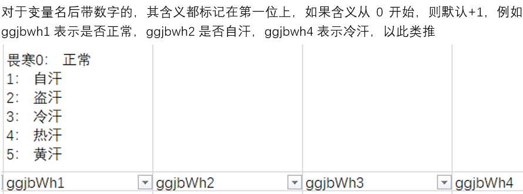

(没时间写了，找时间再补充吧)

#  Intelligent complementary diagnosis of degenerative OA

##### Abstract

退化性骨关节病又称骨关节炎，是一种退化性病变，系由于增龄、肥胖、劳损、创伤、关节先天性异常、关节畸形等诸多因素引起的关节软骨退化损伤、关节边缘和软骨下骨反应性增生。临床表现为缓慢发展的关节疼痛、压痛、僵硬、关节肿胀、活动受限和关节畸形等。

作为中医优势病种，骨关节病中医数据在统计特征选择中起到了关键作用。相比西医的X线、CT等光学诊断数据，中医的脉诊、舌色等“望闻问切”的数据能较好的反映部分骨关节病症的隐含细节，提供更可靠、更快捷且低成本的诊断结果，具有重要的分析价值和挖掘潜力。

基于近年来中医在治疗骨关节病症方面的研究成果，该项目首先梳理了近年来有关退化性骨关节病的研究工作，然后从遵循中医整体思维的角度，提出了一种客观化、规范化、智能化的退化性骨关节病辅助诊断手段，即**结合人工智能技术，结合特征选择、深度学习的方法，从当地医院收集骨关节病患者的性状特征数据来训练神经网络，构建精准高效的骨关节病预测模型，并最终投入应用在小程序或网站平台等用户界面上。**该项目能为骨关节病人的症状评估提供参考，方便群众对骨关节炎的早期预防和诊断。

# Introduction

# Related Work

- 机器学习
- 深度学习
- 迁移学习
- 多标签分类
- 主成分分析法

# Methodology

- Step1.在公开数据集上预训练了多种常用分类模型进行效果比对

- Step2.将预训练模型的参数迁移到中医数据集上，发现随机森林效果最好
  
- Step3.为了提高准确率，我们采用深度学习方法训练一个作用在中医数据集上的模型
- Step4.为了减少参数，采用主成分分析法(PCA)进行降维
- Step5.为了同时保证学习效率和参数量，选用自适应学习率方法最佳

# Experiments

### 1 Dataset

##### 1.1 数据集介绍

1.1 一般资料 本研究的患者均为 2011-2021 年暨南大 学附属第一医院、佛山市中医院、五邑中医院骨关节科、 湖南中医药大学附属第一医院的门诊和住院患者。共纳入 5013 例样本，其中健康样本 601 例，膝骨关节炎患病样本 4412 例。数据集包含 556 个变量，其中膝骨关节炎、平和 质、气虚质、阳虚质、阴虚质、痰湿质、湿热质、血瘀质、 气郁质以及特禀质等 10 个变量作为标记。 

1.2 诊断标准 KOA 诊断标准参照《膝骨关节炎中医 诊疗指南(2020 年版)》[10] Kellgren－Lawrence 影像分级。 1.3 纳入标准 ①男女不限 ②签署知情同意书。 

1.4 数据预处理 为了降低数据的稀疏性，控制正负样 本比例，加快模型收敛速度，对数据集进行降采样、空缺 值填补、特征分解、对频数为零的特征进行剔除以及归一 化处理。最后得到 1421 例样本作为训练集，其中 KOA 患 者样本 1111 例，男性患者 309 例，女性患者 802 例，平 均年龄为 66.40 岁，平均体重 59.51 千克。

##### 1.2 数据说明

对于0-1间的连续值是经过最值归一化处理后的结果

对于除了性别外的0，1值，0表示否，1表示是

对于变量名后带数字的，其含义都标记在第一位上，如果含义从0开始，则默认+1，例如ggjbwh1表示是否正常，ggjbwh2是否自汗，ggjbwh4表示冷汗，以此类推

##### 1.3 数据集呈现

### Pre-Process

### Results

# Conclusion

